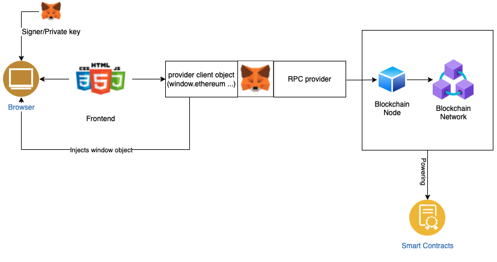

- [References](#references)
- [Sample Hardhat Project](#sample-hardhat-project)
- [Notes](#notes)
  - [hardhat init](#hardhat-init)
  - [hardhat-deploy package](#hardhat-deploy-package)
- [Frontend - Mini dapp](#frontend---mini-dapp)
  - [Dapp minimal architecture](#dapp-minimal-architecture)
  - [deployment steps](#deployment-steps)

# References
- https://github.com/PatrickAlphaC/hardhat-fund-me-fcc
- https://github.com/wighawag/hardhat-deploy?tab=readme-ov-file  

# Sample Hardhat Project

This project demonstrates a basic Hardhat use case. It comes with a sample contract, a test for that contract, and a Hardhat Ignition module that deploys that contract.

Try running some of the following tasks:

```shell
npx hardhat help
npx hardhat test
REPORT_GAS=true npx hardhat test
npx hardhat node
npx hardhat ignition deploy ./ignition/modules/Lock.js
```

# Notes
## hardhat init
hardhat does not provide advanced project option (at least not on ^2.22.3), therefore folder structure needs to be built manually.

## hardhat-deploy package
Hardhat-deploy package here: https://github.com/wighawag/hardhat-deploy?tab=readme-ov-file  
`npm install hardhat-deploy`  
`npm install -D hardhat-deploy`

when deploying (yarn hardhat deploy), hardhat-deploy package compiles and all contracts under contracts/ folder.
In addition, it runs all scripts under deploy/ folder.
**hre** is enriched with 4 new fields and passed to the exported functions of the deploy/*.js files.

And add the following statement to your hardhat.config.js:  
`require('hardhat-deploy');`

if you use ethers.js we recommend you also install hardhat-deploy-ethers which add extra features to access deployments as ethers contract.  
`npm install --save-dev  @nomiclabs/hardhat-ethers hardhat-deploy-ethers ethers`

More details on hardhat-deploy-ethers repo: https://github.com/wighawag/hardhat-deploy-ethers#readme

# Frontend - Mini dapp
## Dapp minimal architecture


## deployment steps
- start a localhost node, or deploy contract within testnet if not already.
  - localhost: `yarn hardhat node` (under the project root / folder)
- Onboard localhost chain in metamask: 
```diff
- DO NOT USE PERSONAL PRIVATE KEYS. CREATE NEW ONES SPECIFICALLY FOR THE TEST, OR USE HARDHAT KEYS.
```
- Ensure abi and contract addresses under exports.js are correct before proceeding.
- build with: `yarn build` (make sure you are under the frontend/ folder for this step)
- open frontend/index.html